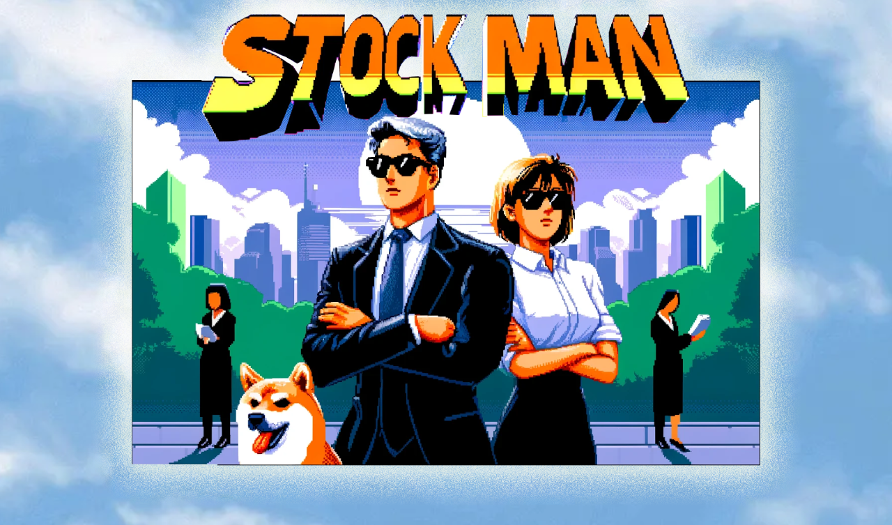
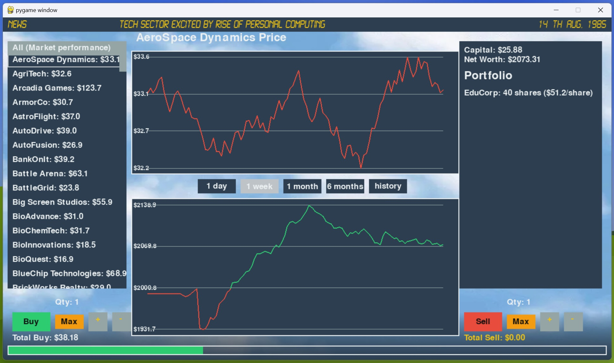

# Stock Man - "Trade fast, live large, retire rich!"

## Overview

Stock Man is a 1980s-themed stock simulation game that balances engaging dynamics with fun sound design and unpredictability. Dive into the retro world of stock trading and try your luck at becoming the ultimate stock tycoon.


## Version
1.0

## Features

- **Retro Stock Trading**: Experience stock trading as it was in the 1980s.
- **Dynamic Market**: Unpredictable market fluctuations keep the game challenging.
- **Engaging Sound Design**: Immersive sound effects enhance the gaming experience.
- **User-Friendly Interface**: Easy-to-navigate menus and controls.

## Installation

### Prerequisites

- **Python 3.x**
- **Pygame**

### Install Pygame

You can install Pygame using pip:

```bash
pip3 install pygame
```

## Clone the Repository
```bash
git clone https://github.com/MIKKELLORENZ/stockman.git
```

## Running the Game
```bash
python3 stockman.py
```

## How to Play
1. **Understanding the Interface**:
   - **Stocks List**: On the left, you'll find a list of available stocks. Click on a stock to view its details and make trading decisions.
   - **Portfolio**: On the right, your current portfolio displays your investments, capital, and net worth.
   - **News Bar**: Stay informed with real-time news that can impact stock prices and market trends.
   - **Graphs**: Visualize your net worth and market performance through interactive graphs.

2. **Buying Stocks**:
   - Select a stock from the list.
   - Choose the quantity you wish to buy using the plus and minus buttons or the "Max" option to invest all available capital.
   - Click the "Buy" button to purchase the selected quantity. Ensure you have enough capital to cover the purchase and any broker fees.

3. **Selling Stocks**:
   - Select a stock from your portfolio.
   - Choose the quantity you wish to sell using the plus and minus buttons or the "Max" option to sell all shares.
   - Click the "Sell" button to execute the sale. Broker fees will be deducted from your earnings.

4. **Managing Your Portfolio**:
   - Monitor your investments and make informed decisions based on market trends and news updates.
   - Diversify your portfolio to mitigate risks and maximize returns.

5. **Progressing Through Time**:
   - Each in-game day represents a real-time interval where stock prices fluctuate.
   - Manage dividends, account fees, and seasonal effects to maintain and grow your capital.

6. **Winning the Game**:
   - There's no definitive end to the game. Strive to grow your net worth as high as possible and become a legendary stock trader!

### Tips for Success
- **Stay Informed**: Pay attention to the news bar for updates that can affect stock prices.
- **Diversify**: Invest in different industries to spread risk.
- **Manage Capital**: Keep an eye on your capital and make sure to cover account fees to avoid unnecessary deductions.
- **Analyze Trends**: Use the graphs to understand market performance and adjust your strategies accordingly.



## Assets
Please note that the sound effect game_music.mp3 is copyrighted by EA and originates from the game SimCity 4000. The real name of the song is "Wheels of Progress"

## Contributions
Contributions are welcome! Please open an issue or submit a pull request

<a href="https://www.buymeacoffee.com/mvlorenz" target="_blank"></a>
